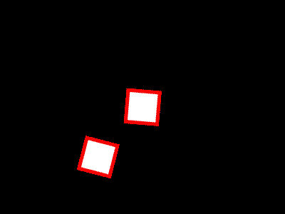

2-Parent and Child
====================

In the last example we created a ball GameObject. We got a circle to appear
at the location of the GameObject using AddChildShape. Adding a child Shape
sets the location of that shape as a child of the GameObject. In the same way
we can set a GameObject to be a child of another GameObject.

Let's create a simple GameObject which has a Rectangle for a Shape. Every frame,
we take the Transform of the GameObject and increment the rotation by 0.03 radians
so it spins.

.. code-block:: C#

    class Box : GameObject
    {
        public override void Start()
        {
            AddChildShape(new Polygon(vec2.Zero, new vec2(100), 0, 4, Color.White, 10, Color.Red));
        }
        public override void Update()
        {
            transform.Rotation += 0.03f;
        }
    }

**Canvas Instantiate**

GlCanvas.Instantiate is similar to Add in that it will add a GameObject to the canvas.
If you would like easy was to set the initial position of a GameObject use Instantiate.
Instantiate also creates a deep copy clone of your original which makes it useful for 
GameObjects with many instances such as projectiles.

.. code-block:: C#

    Box A = can.Add(new Box()) as Box;
    Box B = can.Instantiate(new Box(), new vec2(150)) as Box;

We put the first box in the center of the screen and the second offset from the center.
This creates our orbiting effect. If we give both boxes the same global location they will
be in the same spot, just spinning at different speeds.

.. code-block:: C#

    A.AddChildGameObject(B);

|
|
|

And just like that, we have an orbiting effect. The Transform of Box B will
first apply the Transform of the Box A before it's own. 

|
|
|
|

Using parent child relationships is a great way to accomplish many simple tasks as well.
If you have something in your game with multiple elements, you can use parent child relationships
to keep them together.