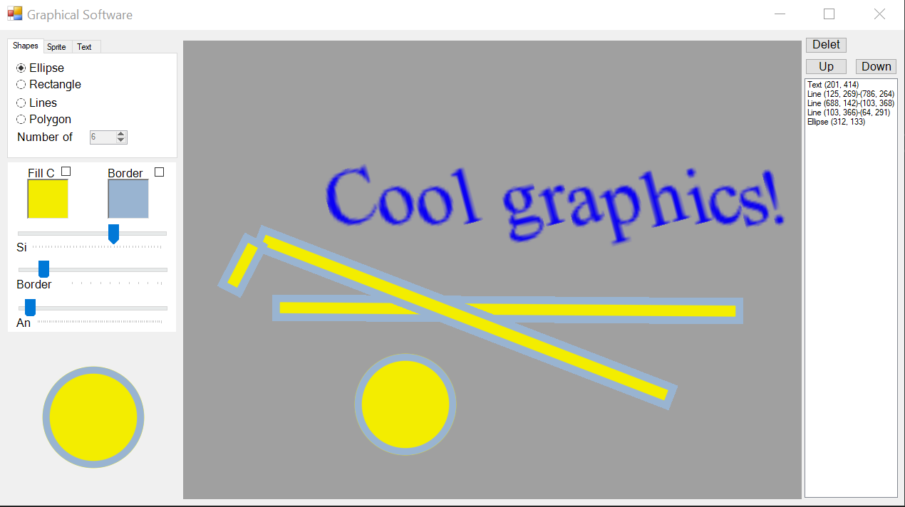

Embedded Canvas
================

When working with a Windows forms application, it's not always convenient to have to open up a second window for your canvas.
Fortunatly, GLDrawer has built in functionality to expose the native window component of a canvas and embed it into your forms.

To insert a canvas in your form, open the designer first. Add a new panel which has the location and size of your desired canvas.

.. image:: images/formsExample1.png
   :width: 1915px
   :height: 1074px
   :scale: 36 %
   :alt: window example
   :align: left

|
|
|
|
|
|
|
|
|
|
|
|
|
|
|

In the above example, the panels have had their back color set to black so they would be easy to see. Nothing else was changed to them.
In order to get a canvas to show up on both panels, we need to create a canvas like before, but with special parameters.

.. code-block:: C#

    //we simply call the constructor and give our form and our panel as arguments
    GLCanvas can = new GLCanvas(this, largePanel);

    //the small panel gets the same background color as the form to look transparent
    GLCanvas previewCan = new GLCanvas(this, smallPanel, BackColor: BackColor);

Success! now we can use the canvas' like normal. The panels used are still in the background, 
but the canvas will follow it around and even appear as the same window in the taskbar.